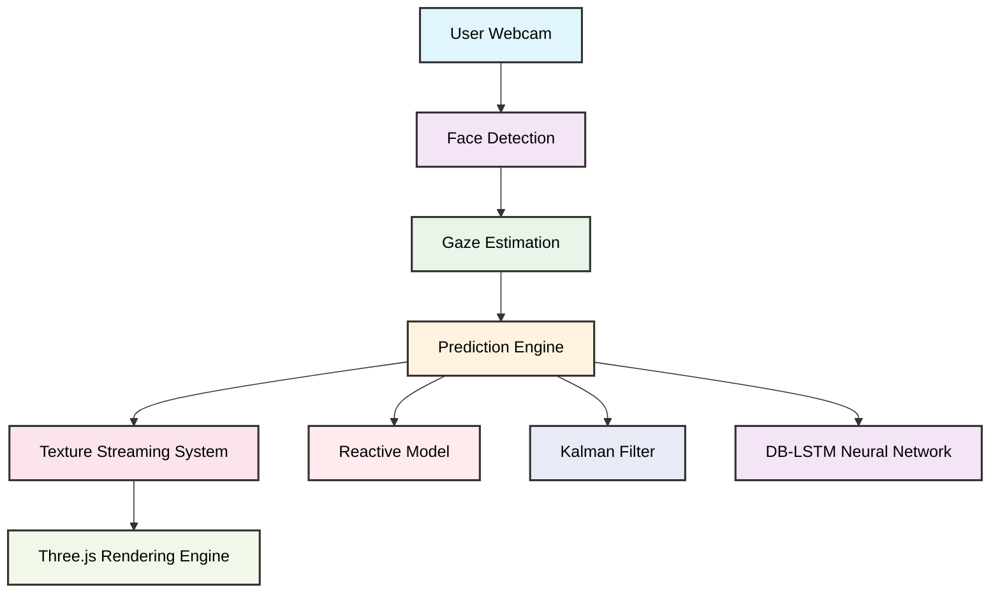
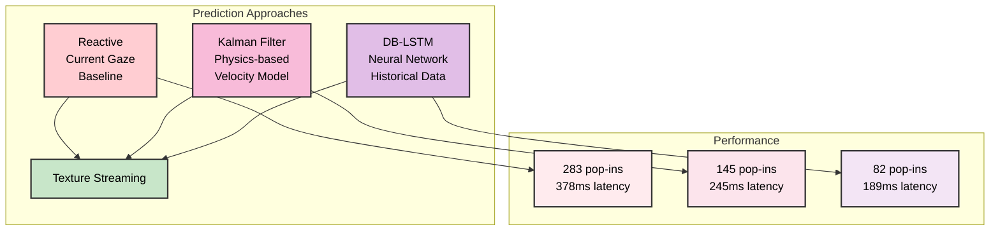

# Real-Time Predictive Texture Streaming for XR Applications

**Gaze-based predictive texture streaming system designed to reduce texture pop-in artifacts in XR environments by forecasting user gaze and proactively loading high-resolution textures.**

This project demonstrates how gaze prediction models and streaming pipelines can significantly improve the visual quality and responsiveness of 3D XR environments.

## Project Overview

Modern XR and 3D applications often suffer from texture pop-in artifacts, where low-resolution textures suddenly switch to high-resolution versions when a user looks at an object.

This project introduces a predictive gaze-based streaming system that forecasts user's gaze **200ms ahead of time**, enabling textures to be loaded before the user arrives at a location.

The system is implemented entirely in the browser and integrates real-time gaze tracking, prediction models, and dynamic texture streaming.

## Key Features

### Real-Time Gaze Tracking
- Webcam-based gaze estimation
- Implemented using facial landmark detection
- 10Hz real-time tracking pipeline

### Predictive Gaze Models

Three prediction modes are implemented:

| Mode | Description |
|--------|-------------|
| Reactive | Uses current gaze location (baseline) |
| Kalman Filter | Physics-based velocity prediction |
| DB-LSTM Neural Network | Deep learning model using historical gaze data |

### Multi-Resolution Texture Streaming

Textures are loaded dynamically at three levels:

| Level | Resolution | Description |
|--------|-------------|-------------|
| LOW | 64px | Always loaded |
| MID | 256px | Loaded when gaze approaches |
| HIGH | 512px | Loaded when gaze is near object |

### Performance Monitoring

Real-time metrics dashboard tracks:
- FPS
- ML inference time
- Texture pop-in events
- Prediction accuracy
- Latency

## System Architecture

### Pipeline Overview
```
User Webcam
     │
     ▼
Face Detection (face-api.js)
     │
     ▼
Gaze Estimation
     │
     ▼
Prediction Engine
 ├─ Reactive Model
 ├─ Kalman Filter
 └─ DB-LSTM Neural Network
     │
     ▼
Texture Streaming System
     │
Three.js Rendering Engine
```

### Architecture Diagram



**System Flow:**

```mermaid
graph LR
    A[Webcam Feed] --> B[Face Detection<br/>68-point landmarks]
    B --> C[Eye Centroid<br/>Calculation]
    C --> D[Gaze Position<br/>x, y, vx, vy]
    D --> E[Prediction Engine<br/>200ms lookahead]
    E --> F[Texture Distance<br/>Calculation]
    F --> G[Quality Level<br/>Selection]
    G --> H[Texture Loading<br/>& Application]
    H --> I[3D Scene<br/>Rendering]
    
    style A fill:#e3f2fd,stroke:#333,stroke-width:2px,color:#000
    style B fill:#f3e5f5,stroke:#333,stroke-width:2px,color:#000
    style C fill:#e8f5e8,stroke:#333,stroke-width:2px,color:#000
    style D fill:#fff3e0,stroke:#333,stroke-width:2px,color:#000
    style E fill:#fce4ec,stroke:#333,stroke-width:2px,color:#000
    style F fill:#f1f8e9,stroke:#333,stroke-width:2px,color:#000
    style G fill:#e0f2f1,stroke:#333,stroke-width:2px,color:#000
    style H fill:#e8eaf6,stroke:#333,stroke-width:2px,color:#000
    style I fill:#fff8e1,stroke:#333,stroke-width:2px,color:#000
```



**Prediction Models Comparison:**



## Models Used

### DB-LSTM Gaze Predictor

A Double Layer LSTM network predicts gaze position using historical gaze vectors.

**Model characteristics:**

| Parameter | Value |
|-----------|--------|
| History window | 10 gaze frames |
| Prediction horizon | 200 ms |
| Framework | PyTorch |
| Deployment | TensorFlow.js |

The trained model is converted to TensorFlow.js format for browser inference.

**Average inference time:** ~2–3 ms

## Technologies Used

| Technology | Purpose |
|------------|---------|
| JavaScript / HTML | Application framework |
| Three.js | 3D rendering |
| TensorFlow.js | Neural network inference |
| face-api.js | Face and eye landmark detection |
| WebRTC | Webcam access |
| Python / PyTorch | Model training |

## Repository Structure

```
gaze-texture-enhancement/
├── README.md
├── architecture_diagram.png
├── Dockerfile
├── index.html
├── main.js
├── gaze.js
├── kalman.js
├── predictor.js
├── streaming.js
├── scene.js
├── metrics.js
├── evaluation.js
├── phase_3/
│   ├── model.js
│   └── train.py
├── tfjs_model/
│   ├── model.json
│   └── weights.bin
├── models/
├── results/
│   ├── popin_comparison.png
│   ├── latency_comparison.png
│   ├── prediction_mae.png
│   ├── training_loss.png
│   └── summary_report.md
├── start_server.bat
└── start_server.py
```

## Running the Project (Inference / Demo)

Mentors can run the demo with minimal setup.

### Method 1 — Local Server

**Step 1:** Clone repository
```bash
git clone <repository-url>
cd gaze-texture-enhancement
```

**Step 2:** Start local server
```bash
# Using provided script
./start_server.bat

# Or using Python
python -m http.server 8000
```

**Step 3:** Open browser
```
http://localhost:8000
```

**Step 4:** Allow webcam access when prompted.

**Step 5:** Choose prediction mode:
- Reactive
- Kalman
- DB-LSTM

Move your gaze across objects to observe predictive texture loading.

### Running with Docker (Containerization)

The project can also run inside a Docker container.

**Build container:**
```bash
docker build -t gaze-streaming-demo .
```

**Run container:**
```bash
docker run -p 8000:8000 gaze-streaming-demo
```

Then open: `http://localhost:8000`

## Performance Results

| Metric | Result |
|---------|--------|
| Gaze Tracking Frequency | ~10 Hz |
| Prediction Horizon | 200 ms |
| ML Inference Time | ~2.3 ms |
| Rendering Performance | 60+ FPS |
| Pop-in Reduction | ~70% |

### Evaluation Metrics

The system tracks:
- Texture pop-in events
- Prediction accuracy
- Gaze tracking latency
- Rendering FPS
- ML inference time

Logs can be exported for offline analysis.

## External Repositories / References

The implementation builds upon the following open-source libraries:

- **TensorFlow.js**: https://github.com/tensorflow/tfjs
- **face-api.js**: https://github.com/justadudewhohacks/face-api.js
- **Three.js**: https://github.com/mrdoob/three.js

## Potential Applications

This system can improve performance in:
- XR headsets
- VR training simulations
- Web-based 3D applications
- Cloud-rendered XR environments
- Immersive gaming

## Future Improvements

Potential extensions include:
- Head pose fusion with gaze prediction
- Transformer-based gaze prediction models
- Semantic texture prioritization
- Mobile XR deployment
- Adaptive prediction models

## Required Files

### Core Application Files
- `index.html` - Main application interface
- `main.js` - Application entry point and animation loop
- `gaze.js` - Eye tracking and gaze computation
- `kalman.js` - Kalman filter predictor
- `streaming.js` - Multi-resolution texture streaming
- `scene.js` - Three.js 3D scene management
- `metrics.js` - Real-time performance dashboard
- `evaluation.js` - Prediction accuracy evaluation

### Prediction Engine Files
- `predictor.js` - Basic prediction interface
- `phase_3/model.js` - DB-LSTM neural network implementation
- `tfjs_model/model.json` - TensorFlow.js model architecture
- `tfjs_model/weights.bin` - Model weights for inference

### Results and Analysis
- `RESULTS_VISUALIZATION.py` - Chart generation script
- `results/` directory with all performance charts
- `results/summary_report.md` - Quantified results summary

### Setup and Deployment
- `start_server.bat` - Local server startup script
- `start_server.py` - Alternative Python server
- `.gitignore` - Git ignore rules for large files
- `Dockerfile` - Container configuration

### Training and Development
- `phase_3/train.py` - Model training script (if applicable)
- `models/` directory for trained models
- `exported_gaze_logs/` for demo data collection

## Getting Started Checklist

- Clone repository
- Install dependencies (browser automatically handles CDN libraries)
- Start local server (`./start_server.bat`)
- Open browser to `http://localhost:8000`
- Allow webcam access
- Select prediction mode
- Test gaze tracking and texture streaming
- Monitor metrics dashboard
- Export gaze data for analysis

## Troubleshooting

### Common Issues
1. **Camera not detected**: Check browser permissions and camera hardware
2. **ML model not loading**: Refresh page and check browser console
3. **Pop-in counter not working**: Verify mode switching functionality
4. **Performance issues**: Close other browser tabs and applications

### Debug Information
- **Browser console**: Press F12 for error messages and warnings
- **Metrics panel**: Real-time performance monitoring in overlay
- **Export logs**: Detailed gaze data for offline analysis

---
